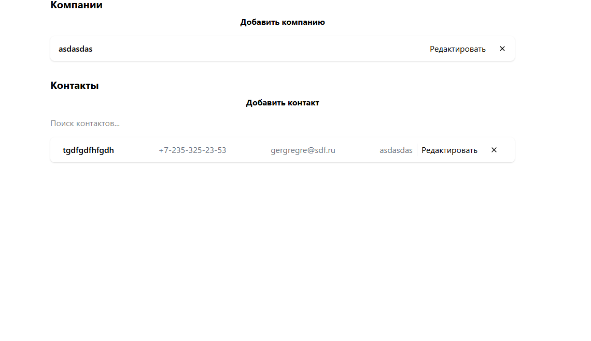

# Список контактов

## Запуск проекта

```npm run dev```

## Сборка проекта

```npm run build```

## Интерфейс



# Функции приложения

Добавление, редактирование, удаление и отображение компаний. По нажатию на "Добавить компанию" можно ввести название компании и сохранить ее (сохраняется в indexedDB).

Добавление, редактирование, удаление и отображение контактов. Для того, чтобы добавить контакт, нужно нажать на "Добавить контакт", ввести данные, выбрать компанию (если есть) и нажать "Добавить".

Для разработки использовался Cursor. С помощью него было инициализировано приложение, спроектирована архитектура, реализованы компоненты Svelte и верстка.