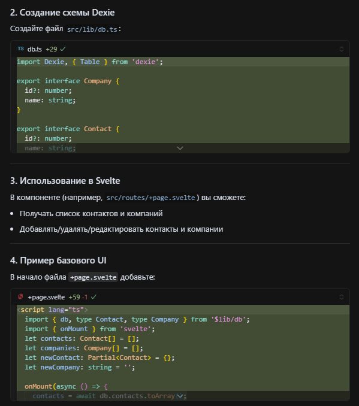

# Этапы разработки с временными метками

## Настройка проекта - 5 мин

Ассистенту был задан промт:
```
Привет. Необходимо создать веб-приложение с использованием SvelteKit, TypeScript, dexie и Tailwind CSS. 
```
На который был получен ответ:


Затем ассистентом была предложена последовательность инициализационных команд, которые были выполнены.

## Создание структуры проекта - 15 мин

Затем, ассистенту был обозначен контекст приложения:

```
Необходимо реализовать веб приложение Список контактов (имя, телефон, email, компания). Схема должна быть настроена с помощью dexie (2 таблицы).
```

В ответ было предложено создать базовую схему Dexie и пример базового UI:



Дополнительно был задан промт для уточнения архитектуры приложения:

```
В этом проекте необходимы CRUD операции, поиск по полям контактов, адаптивный интерфейс (Tailwind). Какие есть предложения по архитектуре?
```

Ассистент предложил использовать 
```
src/
  lib/
    db.ts            // Dexie-схема и методы работы с БД
    stores.ts        // Svelte stores для реактивности (опционально)
    utils.ts         // Вспомогательные функции (например, для поиска)
    components/
      ContactForm.svelte
      ContactList.svelte
      CompanyForm.svelte
      CompanyList.svelte
      SearchBar.svelte
  routes/
    +page.svelte     // Главная страница (контакты + поиск)
    companies.svelte // (опционально) управление компаниями
    
``` 
В дальнейшем архитектура дорабатывалась.

# Основная функциональность - 1 час
Было решено использовать сторы свелткита для удобного проброса данных между компонентами. Поскольку этапы у ассистента были сформированы, промт выглядел лаконично:
```
Напиши Stores
```
Пример реализованного с помощью ИИ-ассистента contactStore:


Для реализации первичных компонентов форм соответствующий запрос был отправлен ассистенту:
```
Реализуй компоненты форм
```
Ответ:


Также, был реализован компонент Toast для вывода сообщений об ошибках в правом верхнем углу монитора, дизайн которого дорабатывался ассистентом.


В дальнейшем компоненты форм дорабатывались. Был создан компонент модального окна, формы начали отображаться в нем. Также, был реализован поиск и дебаунс для него:


Пример доработки фронтенда:


# Финальная доработка (типизация, README и документация) - 40 минут

Для экономии времени была запрошена типизация у ассистента: 


# Отладка и тестирование - 15 минут

# Бонусные функции - параллельно предыдущим этапам.